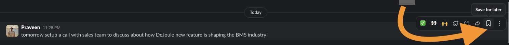

# slask 🔖→ ✅

> Click "Save for later" on a Slack message. Get a structured Google Task. Powered by AI.

**slask** (Slack + Tasks) turns your "Save for later" bookmarks into actionable, AI-enriched Google Tasks — automatically. No copy-pasting, no context switching, no forgotten follow-ups.



---

## The Problem

You're deep in Slack. Someone shares something important — a bug report, a request, a deadline. You click the 🔖 "Save for later" bookmark to deal with it later.

Later never comes.

Saved messages pile up. Important things get buried. Tasks discussed in chat never make it to your task manager.

## The Solution

slask watches for "Save for later" bookmarks and does the heavy lifting:

1. You click 🔖 **Save for later** on any Slack message
2. slask sends it to an LLM
3. The LLM extracts a structured task — title, description, bullet points, due date
4. A clean Google Task appears in your list, with a link back to the original message

No manual entry. No lost context. Just tasks that are actually actionable.

---

## How It Works

```
┌─────────────────────────────────────────────────────────────┐
│                        SLACK                                │
│   You click 🔖 "Save for later" on a message               │
└──────────────────────────┬──────────────────────────────────┘
                           │  star_added webhook event
                           ▼
┌─────────────────────────────────────────────────────────────┐
│                   WEBHOOK HANDLER                           │
│   • Verifies Slack signature (HMAC-SHA256)                  │
│   • Routes event to Task_Enricher                           │
│   • Responds HTTP 200 immediately (no timeout)              │
└──────────────────────────┬──────────────────────────────────┘
                           │
                           ▼
┌─────────────────────────────────────────────────────────────┐
│                     LLM AGENT                               │
│   • Builds prompt with message text + link + current date   │
│   • Calls GLM-4.7 (or any OpenAI-compatible API)            │
│   • Parses + validates structured Enriched_Task JSON        │
└──────────────────────────┬──────────────────────────────────┘
                           │  Enriched_Task
                           ▼
┌─────────────────────────────────────────────────────────────┐
│                 GOOGLE TASKS CLIENT                         │
│   • Sets task title (+ "[Needs Clarification]" prefix)      │
│   • Formats notes: description + bullets + message link     │
│   • Sets due date in RFC 3339 if extracted by LLM           │
└──────────────────────────┬──────────────────────────────────┘
                           │
                           ▼
┌─────────────────────────────────────────────────────────────┐
│                    GOOGLE TASKS                             │
│   ✅ Structured task in your default list                   │
└─────────────────────────────────────────────────────────────┘
```

---

## What You Get

A raw Slack message like:

> "tomorrow setup a call with sales team to discuss about how DeJoule new feature is shaping the BMS industry"

Becomes a Google Task like:

```
Title:       Schedule sales call on DeJoule BMS feature
Description: Set up a call with the sales team to discuss how DeJoule's
             new feature is impacting the BMS industry.
Bullets:     - Schedule the call for tomorrow
             - Invite relevant sales team members
             - Prepare talking points on DeJoule's new feature
             - Discuss BMS industry impact
Due:         2026-03-06
Notes:       https://slack.com/archives/C123/p1234567890
```

---

## Features

- **AI-enriched tasks** — LLM extracts title, description, action items, and due dates from natural language
- **Relative date resolution** — "tomorrow", "EOD", "next Monday" → absolute dates
- **Needs clarification flag** — ambiguous messages get `[Needs Clarification]` prefix instead of being dropped
- **Slack signature verification** — HMAC-SHA256 validates every request
- **Vercel-ready** — serverless HTTP handler, no persistent connection needed
- **Error monitoring** — Sentry captures all exceptions across the pipeline
- **Fully testable** — constructor injection throughout, 68 tests, zero network calls in unit tests
- **Provider-agnostic LLM** — swap providers with a single env var change

---

## Tech Stack

| Layer | Technology |
|---|---|
| Runtime | Node.js |
| Webhook | Native HTTP (Vercel serverless compatible) |
| Slack integration | Events API (HTTP webhook) |
| LLM | GLM-4.7 via z.ai (any OpenAI-compatible API) |
| Google integration | googleapis (OAuth2) |
| Error monitoring | Sentry |
| Testing | Jest + fast-check (property-based) |

---

## Prerequisites

- Node.js v18+
- A [Slack app](https://api.slack.com/apps) with Events API enabled
- A [Google Cloud project](https://console.cloud.google.com) with Tasks API enabled
- An LLM API key (z.ai / ZhipuAI / OpenAI / any OpenAI-compatible)
- A [Sentry](https://sentry.io) project (optional but recommended)

---

## Installation

```bash
git clone https://github.com/praveenqumar/slask.git
cd slask
npm install
cp .env.example .env
```

---

## Configuration

### 1. Environment Variables

Fill in `.env`:

```env
# Slack
SLACK_SIGNING_SECRET=your_signing_secret

# Google
GOOGLE_CLIENT_ID=your_google_client_id
GOOGLE_CLIENT_SECRET=your_google_client_secret
GOOGLE_REFRESH_TOKEN=your_refresh_token

# LLM (defaults to ZhipuAI GLM-4.7 via z.ai)
LLM_API_KEY=your_llm_api_key
LLM_API_BASE_URL=https://api.z.ai/api/paas/v4/chat/completions
LLM_MODEL=glm-4.7

# Sentry (optional)
SENTRY_DSN=https://...@sentry.io/...
```

To use OpenAI instead, just swap:
```env
LLM_API_BASE_URL=https://api.openai.com/v1/chat/completions
LLM_MODEL=gpt-4o-mini
LLM_API_KEY=sk-...
```

### 2. Google Refresh Token (one-time setup)

```bash
node scripts/auth.js
```

Follow the browser prompt, then copy the printed `refresh_token` into your `.env`.

### 3. Slack App Setup

1. Go to [api.slack.com/apps](https://api.slack.com/apps) → create or select your app
2. **Event Subscriptions** → enable → set Request URL to your server URL
3. **Subscribe to events on behalf of users** → add `star_added`
4. **Install App** → reinstall to apply changes
5. Copy **Signing Secret** from Basic Information → App Credentials

---

## Running Locally

```bash
# Start the server
node server.js

# In another terminal, expose via ngrok
npx ngrok http 3000
```

Set the ngrok `https://` URL as your Slack Event Subscriptions Request URL. Slack will verify it automatically.

To skip signature verification during local testing:

```bash
NODE_ENV=test node server.js
```

---

## Deploying to Vercel

```bash
vercel --prod
```

Set all `.env` variables in Vercel dashboard → Settings → Environment Variables.

`index.js` exports a standard `(req, res)` handler — no changes needed for Vercel.

---

## Testing

```bash
# Unit tests (no network)
npx jest --testPathPattern=tests/unit --runInBand

# Integration tests
npx jest --testPathPattern=tests/integration --runInBand

# All tests
npm test

# Smoke test your LLM connection
node scripts/test-llm.js
```

---

## Project Structure

```
slask/
├── index.js                          # Webhook handler + Vercel entry point
├── server.js                         # Local HTTP server for development
├── lib/
│   ├── llm-agent.js                  # LLM enrichment (injectable HTTP client)
│   ├── google-tasks-client.js        # Google Tasks API (injectable)
│   ├── task-enricher.js              # Orchestrates LLM → Google Tasks
│   ├── sentry.js                     # Error monitoring
│   └── logger.js                     # Logging utility
├── scripts/
│   ├── auth.js                       # Google OAuth2 token generator
│   └── test-llm.js                   # LLM smoke test
├── tests/
│   ├── unit/                         # Jest unit tests (mocked dependencies)
│   └── integration/                  # Integration tests
├── docs/
│   └── demo.png                      # Screenshot
├── .env.example                      # Environment variable template
└── vercel.json                       # Vercel routing config
```

---

## License

MIT
